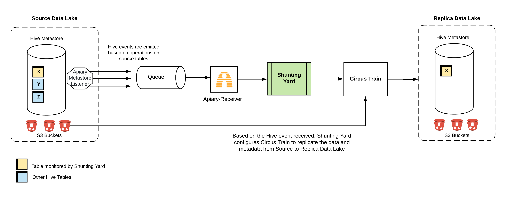

# Shunting Yard

Shunting Yard reads serialized Hive MetaStore Events from a queue ([AWS SQS](https://aws.amazon.com/sqs/) is currently supported) and replicates the data between two data lakes. It does this by building a YAML file with the information provided in the event which is then passed to [Circus Train](https://github.com/HotelsDotCom/circus-train) to perform the replication.

## Start using

You can obtain Shunting Yard from Maven Central:

   

## System architecture

## Overview

Shunting Yard is intended to be a constantly running service which listens to a queue for Hive events. These events are emitted from the Hive metastore based on the operations performed on the Hive tables. For instance, an `ADD_PARTITION_EVENT` is emitted from the Hive metastore when a new partition is added to a table. Similarly, a `CREATE_TABLE_EVENT` is emitted when a new table is created in the Hive metastore. We recommend using [Apiary Metastore Listener](https://github.com/ExpediaGroup/apiary-extensions/tree/master/apiary-metastore-listener) for getting these events from your Hive Metastore.

Once Shunting Yard receives an event from the queue, it extracts the relevant information from it to build a YAML file which it then passes on to [Circus Train](https://github.com/HotelsDotCom/circus-train) which does the replication. Shunting Yard also aggregates a series of events so that a minimum number of replications are performed via Circus Train.

## Install

1. Download the version to use from [Maven Central](https://mvnrepository.com/artifact/com.hotels/shunting-yard-binary) and uncompress it in a directory of your choosing.

[Download the TGZ](https://repository.sonatype.org/service/local/artifact/maven/redirect?r=central-proxy&g=com.hotels&a=shunting-yard&p=tgz&v=RELEASE&c=bin) from Maven central and then uncompress the file by executing:

    tar -xzf shunting-yard-binary-<version>-bin.tgz
    
Although it's not necessary, we recommend exporting the environment variable SHUNTING_YARD_HOME by setting its value to wherever you extracted it to:

    export SHUNTING_YARD_HOME=/<foo>/<bar>/shunting-yard-<version>

2. Download the latest version of [Circus Train](https://repository.sonatype.org/service/local/artifact/maven/redirect?r=central-proxy&g=com.hotels&a=circus-train&p=tgz&v=RELEASE&c=bin) and uncompress it:

    tar -xzf circus-train-<version>-bin.tgz

Set the `CIRCUS_TRAIN_HOME` environment variable:        
    
    export CIRCUS_TRAIN_HOME=/<foo>/<bar>/circus-train-<circus-train-version>
           
## Usage
To run Shunting Yard you just need to execute the `bin/replicator.sh` script in the installation directory and pass the configuration file: 

         $SHUNTING_YARD_HOME/bin/replicator.sh --config=/path/to/config/file.yml

### EMR
If you are planning to run Shunting Yard on EMR you will need to set up the EMR classpath by exporting the following environment variables before calling the `bin/replicator.sh` script:

         export HCAT_LIB=/usr/lib/hive-hcatalog/share/hcatalog/
         export HIVE_LIB=/usr/lib/hive/lib/

Note that the paths above are correct as of when this document was last updated but may differ across EMR versions. Refer to the [EMR release guide](http://docs.aws.amazon.com/emr/latest/ReleaseGuide/emr-release-components.html) for more up to date information if necessary.

## Configuring Shunting Yard

The examples below all demonstrate configuration using YAML and provide fragments covering the most common use cases that should be useful as a basis for building your own configuration. A full configuration reference is provided in the following sections.

### Configuring source, replica and SQS queue

The YAML fragment below shows some common options for setting up the base source (where data is coming from), replica (where data is going to) and the SQS queue to read Hive events from.

    source-catalog:
      name: source-cluster
      hive-metastore-uris: thrift://emr-master-1.compute.amazonaws.com:9083
    replica-catalog:
      name: replica-cluster
      hive-metastore-uris: thrift://emr-master-2.compute.amazonaws.com:9083
    event-receiver:
      configuration-properties:
        com.hotels.shunting.yard.event.receiver.sqs.queue: https://sqs.us-west-2.amazonaws.com/123456789/sqs-queue
        com.hotels.shunting.yard.event.receiver.sqs.wait.time.seconds: 20
    source-table-filter:
      table-names:
        - test_database.test_table_1
    table-replications:
      - source-table:
          database-name: source_database
          table-name: test_table
        replica-table:
          database-name: replica_database
          table-name: test_table_1

### Selecting tables to monitor

Shunting Yard by default will not replicate any table unless few tables are selected using `source-table-filter`. For example, if you wanted Shunting Yard to only monitor two tables, `test_database.test_table_1` and `test_database.test_table_2` you can configure it as follows:

    source-table-filter:
      table-names:
        - test_database.test_table_1
        - test_database.test_table_2

### Specifying target database & table names

Shunting Yard will by default replicate the data into the replica data lake with same replica database name and table name as source. Sometimes this is not ideal and a user might prefer to change the replica database name or table name or both. The YAML fragments below shows some common options for specifying the replica database and table name for the selected tables.

#### Specify both replica database and table name

    table-replications:
      - source-table:
          database-name: source_database
          table-name: test_table
        replica-table:
          database-name: replica_database
          table-name: test_table_1    
          
#### Change only the replica database but the table name remains same as source

In this case, the replica table name is not provided in the `table-replications` and hence, it will be same as source table name.

    table-replications:
      - source-table:
          database-name: source_database
          table-name: test_table
        replica-table:
          database-name: replica_database 

#### Change only the replica table name but the database remains same as source

In this case, the replica database name is not provided in the `table-replications` and hence, it will be same as source database name.

    table-replications:
      - source-table:
          database-name: source_database
          table-name: test_table
        replica-table:
          table-name: test_table_1

### Shunting Yard configuration reference
The table below describes all the available configuration values for Shunting Yard.

|Property|Required|Description|
|:----|:----:|:----|
|`source-catalog.name`|Yes|A name for the source catalog for events and logging.|
|`source-catalog.hive-metastore-uris`|No|Fully qualified URI of the source cluster's Hive metastore Thrift service.|
|`replica-catalog.name`|Yes|A name for the replica catalog for events and logging.|
|`replica-catalog.hive-metastore-uris`|Yes|Fully qualified URI of the replica cluster's Hive metastore Thrift service.|
|`event-receiver.configuration-properties.com.hotels.shunting.yard.event.receiver.sqs.queue`|Yes|Fully qualified URI of the [AWS SQS](https://aws.amazon.com/sqs/) Queue to read the Hive events from.|
|`event-receiver.configuration-properties.com.hotels.shunting.yard.event.receiver.sqs.wait.time.seconds`|No|Wait time in seconds for which the receiver will poll the SQS queue for a batch of messages. Default is 10 seconds. Read more about long polling with AWS SQS [here](https://docs.aws.amazon.com/AWSSimpleQueueService/latest/SQSDeveloperGuide/sqs-long-polling.html).|
|`source-table-filter.table-names`|No|A list of tables selected for Shunting Yard replication. Supported format: `database_1.table_1, database_2.table_2`. If these are not provided, Shunting Yard will not replicate any table.|
|`table-replications[n].source-table.database-name`|No|The name of the database in which the table you wish to replicate is located. `table-replications` section is optional and if it is not provided, Shunting Yard will simply use the database name and table name of source for replica.|
|`table-replications[n].source-table.table-name`|No|The name of the table which you wish to replicate.|
|`table-replications[n].replica-table.database-name`|No|The name of the destination database in which to replicate the table. Defaults to source database name. Defaults to `source-table.database-name`|
|`table-replications[n].replica-table.table-name`|No|The name of the table at the destination. Defaults to `source-table.table-name`|

### Configuring Graphite metrics

Graphite configuration can be passed to Shunting Yard using an optional `--ct-config` argument which takes a different YAML file to the one described above and passes it directly to internal Circus Train instance. Refer to the [Circus Train README](https://github.com/HotelsDotCom/circus-train#graphite) for more details.

#### Sample ct-config.yml for graphite metrics:

    graphite:
      host: graphite-host:2003
      namespace: com.company.shuntingyard
      prefix: dev

### Housekeeping

[Housekeeping](https://github.com/HotelsDotCom/housekeeping) is the process that removes expired and orphaned data on the replica. Shunting Yard delegates housekeeping responsibility to Circus Train. Similar to Graphite configuration, Housekeeping configuration can also be directly passed to the internal Circus Train instance using `--ct-config` argument. Refer to the [Circus Train README](https://github.com/HotelsDotCom/circus-train#configuring-housekeeping) for more details.

#### Sample ct-config.yml for housekeeping:

    housekeeping:
      expired-path-duration: P3D
      db-init-script: classpath:/schema.sql
      data-source:
        driver-class-name: org.h2.Driver 
        url: jdbc:h2:${housekeeping.h2.database};AUTO_SERVER=TRUE;DB_CLOSE_ON_EXIT=FALSE
        username: user
        password: secret
        
## Usage with Circus Train common config
To run Shunting Yard with a Circus Train common config file in addition to it's own config file, you just need to execute the `bin/replicator.sh` script in the installation directory and pass both the configuration files: 

         $SHUNTING_YARD_HOME/bin/replicator.sh --config=/path/to/config/file.yml --ct-config=/path/to/config/ct-common.yml

# Legal
This project is available under the [Apache 2.0 License](http://www.apache.org/licenses/LICENSE-2.0.html).

Copyright 2016-2019 Expedia, Inc.